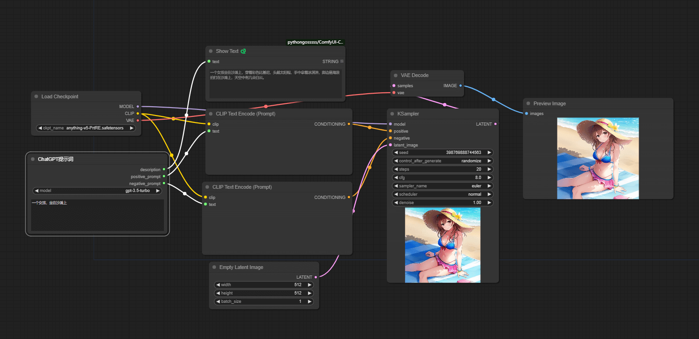

# Easy Tools

通过 **Easy Tools** 的 **ChatGPT Prompt** 节点，使用 ChatGPT 帮助你自动联想生成提示词。你只需提供简短的语句，即可生成更丰富的图片描述，例如 "一个女孩，坐在沙滩上"，生成的图片如下：

---

## 功能介绍

### ChatGPT Prompt 节点

当前支持的模型有 **gpt3.5-turbo** 和 **gpt4**

#### 使用方法

1. 新增两个配置项（可在 ComfyUI 设置中配置）

   - **ChatGPT Base URL**: 如果不使用第三方接口，可以不设置，默认为 `https://api.openai.com/v1`
   - **ChatGPT Token**: API key

2. 在 `Add Node` -> `Easy Tools` -> `ChatGPT Prompt` 可以找到该节点

3. 节点的输出

   - **description**: ChatGPT 根据你提供的提示词重新生成的图片描述
   - **positive_prompt**: 正向提示词
   - **negative_prompt**: 反向提示词

4. 简单连接如下

#### 快速使用

> [!tip] 可直接下载图片，拖拽到 ComfyUI 中使用

## 更新日志

- **2024/1/15**: 去掉不必要的 **positivePromptTranslate** 、 **negativePromptTranslate** 的输出，以提高 ChatGPT 生成速度(预计可以提高一倍)
- **2024/1/14**: 完成基本的 **ChatGPT Prompt** 节点

## 已知问题

- 节点执行速度慢，原因是受限于 **ChatGPT** 的吐字速度，目前只有优化提示词，尽可能只生成必要的内容
- 节点有可能解析错误, 原因是 **ChatGPT** 返回的格式错误，无法正常解析，重试即可

## 计划

- 优化预设提示词
- 开放预设提示词编辑

## LICENSE

MIT
